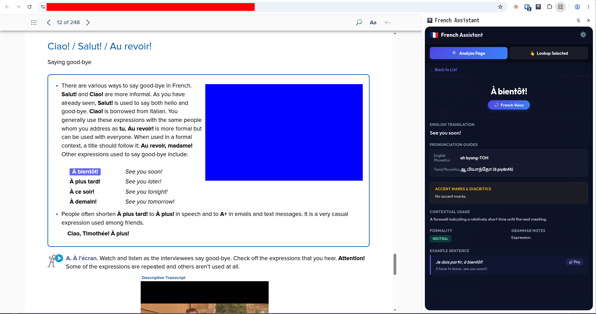
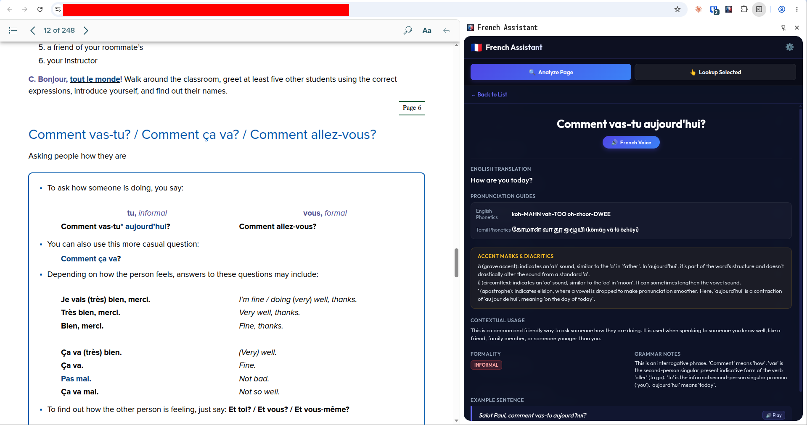

# 🇫🇷 French Assistant — Chrome Extension

A premium Chrome Extension designed to help English-and-Tamil-speaking students learn French while reading textbooks on any online's online reader or any webpage with French content. 

It scans the active webpage, traverses same-origin `srcdoc` iframes, filters out English instructions, extracts key French vocabulary using Gemini, generates custom pronunciation guides in English and Tamil phonetics, and synthesizes speech using ElevenLabs with automatic local audio caching.

---

## 📸 Screenshots

| Word List | Detail View |
|:---------:|:-----------:|
|  |  |

---

## ✨ Features

-   **Deep Content Scanning**: Extracts French text recursively from nested same-origin `srcdoc` iframes while intelligently skipping English headings and instructions (`lang="en"`).
-   **Gemini-Powered Vocabulary Extraction**: Uses `gemini-2.5-flash-lite` to extract key French words, verb forms, and expressions, providing contextual meanings, formality levels, and grammatical details.
-   **Dual-Phonetics Pronunciation Guides**:
    -   **English Phonetics**: High-quality English transliterations (e.g., `bonjour` ➔ `"bohn-ZHOOR"`).
    -   **Tamil Phonetics**: Phonetically accurate Tamil script transliterations along with romanized forms (e.g., `bonjour` ➔ `"போன்ழூர் (pōṉzhūr)"`).
-   **Premium Text-to-Speech (TTS)**: Plays French pronunciation using ElevenLabs Multilingual v2 model with language-aware synthesis.
-   **Accent & Diacritics Guide**: Explains every accent mark (é, è, ê, ç, ô, etc.) and how it changes pronunciation.
-   **In-Page Highlighting**: Clicking a word scrolls the textbook page to its occurrence and highlights it.
-   **Search**: Filter your vocabulary list by French word or English meaning.
-   **Offline Audio Caching**: Caches synthesized MP3 clips in IndexedDB to minimize API usage and ensure instantaneous playback on repeat clicks.
-   **Persistent Session Memory**: Saves currently analyzed words in local browser storage (`chrome.storage.local`) so your session isn't lost when closing the side panel.
-   **Text Selection Lookup**: Highlight any word or sentence on the page and click "Lookup Selected" to instantly translate and slide open its detail card.

---

## 📂 File Structure

```
French Assistant/
├── manifest.json            # Extension Manifest V3 configuration
├── README.md                # Project documentation & guides
├── The Plan.md              # Original architecture and strategy draft
├── icons/                   # Resized branding icons
│   ├── icon16.png
│   ├── icon48.png
│   └── icon128.png
├── lib/
│   └── audio_cache.js       # IndexedDB manager for audio caching
├── prompts/                 # Gemini API system prompts
│   ├── page_analysis.txt    # Prompts for full page scanning
│   └── word_lookup.txt      # Prompts for highlighting a specific word
├── scripts/
│   ├── service_worker.js    # Background orchestrator & routing
│   ├── content_script.js    # DOM parser (iframe traversal & text extraction)
│   ├── gemini_client.js     # Rest API wrapper for Gemini API
│   └── elevenlabs_client.js # Rest API wrapper for ElevenLabs TTS
├── sidepanel/               # Main panel interface
│   ├── sidepanel.html
│   ├── sidepanel.css
│   └── sidepanel.js
└── options/                 # Configuration options page
    ├── options.html
    ├── options.css
    └── options.js
```

---

## 🚀 Installation & Setup

### 1. Load the Extension into Google Chrome
1.  Open **Google Chrome** and navigate to `chrome://extensions`.
2.  In the top-right corner, turn on **Developer mode**.
3.  In the top-left corner, click the **Load unpacked** button.
4.  Select the project directory:
    the cloned/downloaded project directory
5.  The extension is now installed! The settings configuration page will open automatically.

### 2. Configure Credentials & Settings
You will need your own API keys. Configure them on the settings page:
-   **Gemini API Key**: Obtain a free API key from [Google AI Studio](https://aistudio.google.com/).
-   **Gemini Model**: Choose between `Gemini 2.5 Flash` (default), `Gemini 2.5 Flash Lite`, `Gemini 2.5 Pro`, or enter a custom model name (e.g. `gemini-1.5-flash`).
-   **ElevenLabs API Key**: Obtain an API key from the [ElevenLabs Dashboard](https://elevenlabs.io/).
-   **Voice Selections**:
    -   *French Voice*: Select **Charlotte** (recommended for natural French female narration) or paste a custom Voice ID.
    -   *English Voice*: Select **Rachel** (recommended for conversational English guides) or paste a custom Voice ID.
-   Click **Save Settings**.

---

## 📖 How to Use

### 🔍 Method 1: Scanning a Full Page
1.  Open any French textbook reader or webpage with French content.
2.  Open the **French Assistant Side Panel** by clicking the puzzle icon in Chrome and pinning/clicking the extension.
3.  Click **Analyze Page** in the side panel.
4.  The side panel will show a shimmer skeleton loader while extracting text and calling Gemini.
5.  A list of extracted French words and expressions will load.
6.  Click on any word card to expand its detail drawer.
7.  Click **French Voice** to hear native French audio, or **Play** next to the example sentence to hear it in context.

### 👆 Method 2: Highlighting Text (Quick Lookup)
1.  While reading the textbook page, highlight (select) any French word or phrase with your cursor.
2.  Click **Lookup Selected** in the side panel.
3.  The term will be analyzed by Gemini, added to the top of your list, and the detail view will automatically slide in!

---

## 🛠️ Technical Details for Developers

### 1. Same-Origin Iframe Extraction
The textbook reader uses standard same-origin `srcdoc` iframes. The `content_script.js` handles this by checking for `iframe` tags and recursively traversing their `contentDocument.body`. It filters elements by checking the `lang` attribute:
-   If an element has `lang="en"`, it is skipped, along with all its children.
-   Common UI elements (buttons, inputs, textareas, svgs) are skipped to prevent reading control panel buttons.

### 2. Service Worker Module System
The extension runs background tasks using a Manifest V3 Service Worker. In `manifest.json`, the background service worker is declared with `"type": "module"`, allowing direct `import` statements of the API clients and caching systems.

### 3. Audio Caching
Audio assets are stored in an IndexedDB database named `FrenchAssistantAudioCache` in the `audio_blobs` store. The keys are structured as `lowercase_french_word_voiceId`. When audio is played:
1.  The service worker queries the local cache.
2.  If found, the cached Blob is fetched and converted to an `ArrayBuffer` to be sent to the side panel.
3.  If not found, ElevenLabs is called, the audio is written asynchronously to the IndexedDB, and the `ArrayBuffer` is sent.
